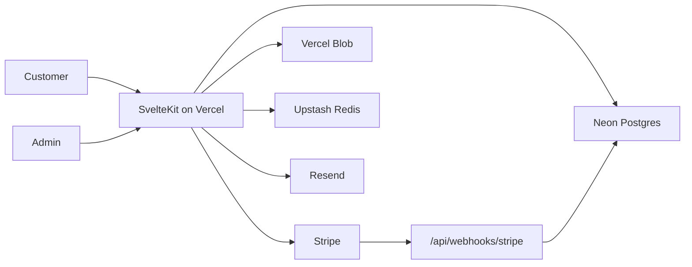

# Architecture

The Trading Store is a SvelteKit application hosted on Vercel. It sells two
database-backed digital products through Stripe Checkout and grants customers
download entitlements after successful payment.

## System Boundary

## Source of Truth

Neon Postgres stores products, prices, purchases, entitlements, download usage,
webhook events, and audit logs. Stripe stores payment objects, but the app does
not read pricing from Stripe at runtime.

## Protected Downloads

1. Admin uploads private PDFs to Vercel Blob.
2. Product rows store Blob pathnames.
3. Stripe webhook creates purchase and entitlement rows.
4. Customer clicks Download in the library.
5. Server verifies auth, entitlement, and quota.
6. Server creates a short-lived signed Blob URL.
7. Server logs the download and audit event.
8. Browser downloads from the signed URL.

Book 1 uses an unlimited entitlement. Book 2 uses a capped entitlement with
three lifetime downloads.

## RBAC

Permissions are enforced in route guards, server handlers, and UI visibility.
Only server checks are security boundaries.

## Operational Data

Webhook events are persisted for idempotency. Audit logs track auth, admin,
billing, entitlement, and download actions.

